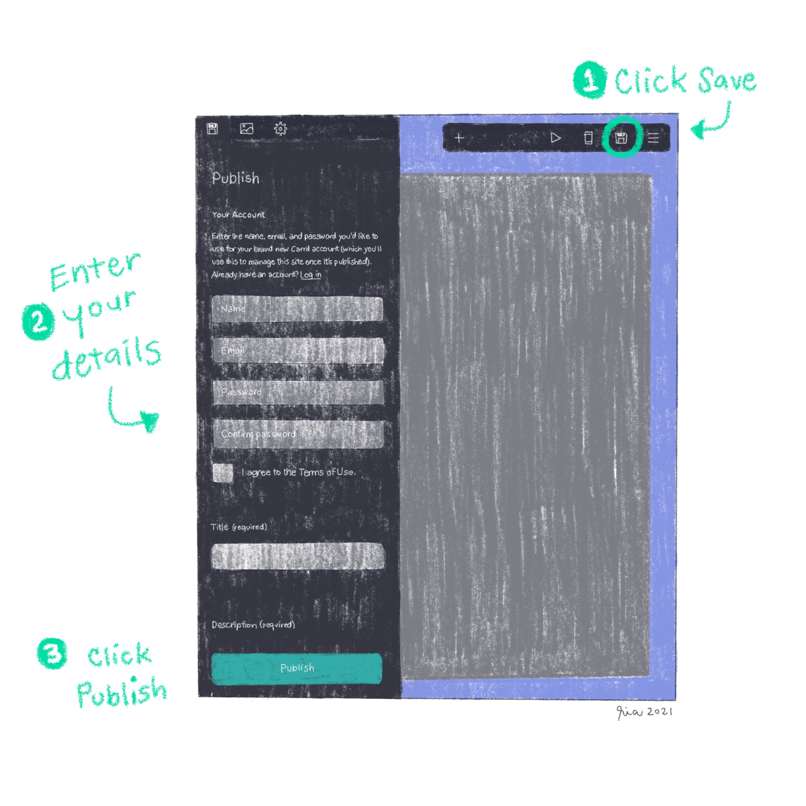

_You can create a snazzy one-page site in just minutes using one of several Carrd.co templates —for free._

Creating a one-page website doesn't have to be painful nor difficult. This seems to be the mantra of Carrd.co. They actually make the process so quick and painless that you can start designing your site *before* creating an account.

Granted, it's going to be difficult to fit a lot of information on a single page, so maybe skip this one if you're looking to create a full-blown site. However, if most of your art or business lives elsewhere on the worldwide web and you just need a simple page, then read on.

## Create a Website

1. Go to [Carrd.co](https://carrd.co).
2. Click **Choose a starting point**.
3. Browse through the template options and select a design.
4. Click **Select**. The website editor opens with the selected template.
5. Customize your design by clicking the different elements to modify texts and images. You can also opt to add or remove elements from the template to fit your needs.

## Create an Account

1. When you're ready, click the **Save** button. This opens a panel on the left side of the screen.
2. Enter your personal name, email address, and password.
3. Confirm the password.
4. Enable **I agree to the Terms of Use**.
5. Enter the site title.
6. Optional: Add a site description.
7. Click **Publish**. That's it! Your new site should be ready soon. 

Here's one I made today in under 15 minutes: [rialitybytes.art on Carrd.co](https://rialitybytesart.carrd.co)
