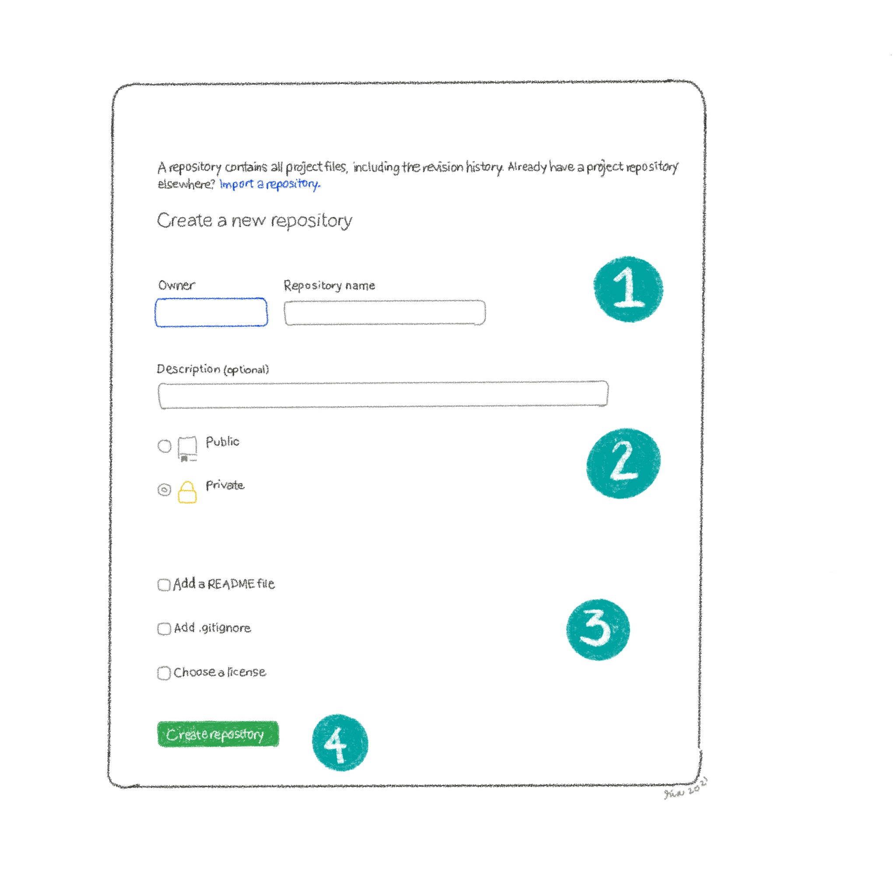

_GitHub isn't just for developers. You can use GitHub repositories to store your images, documents, and other assets._

I have to admit: I was initially intimidated with [GitHub](https://github.com) when I first encountered the site. It seemed like a complicated tool that was only meant for developers with coding experience. Now that I've been using it regularly for over a year, I can confidently say that it's definitely not just for developers. In fact, I really think that more artists should consider using this tool to manage their assets and do a lot of other fun projects.

For now, let's start with baby steps: create an account and a new repository.

## Create a GitHub Account

1. Go to [github.com](https://github.com).
2. Click **Sign up**.
3. Enter a username, email address, and password.
4. Complete the verification step.
5. Click **Create account**.
Congratulations, you are officially a GitHub user.

## Create a GitHub Repository

1. On your GitHub dashboard, click **New**.
2. Enter a repository name. Make it short and easy to read. For example, *assets*.
3. Optional: Add a description to help you remember the repository contents. When you have multiple repositories, it might be difficult to remember which repository contains which file.
4. Select the repository visibility.
	* **Public** - Anyone can view and access the files.
	* **Private** - Only you and authorized users can view and access the files.
5. Optional: Enable the following settings:
	* 	**Add a README file** - This is a text file where you write a short description about the repository.
	* 	**Add .gitignore** - The gitignore file tells GitHub what file types or folders to ignore. Using a gitignore file requires a bit more technical know-how, so skip this option for now.
	* 	**Choose a license** - If you intend to make your files public, it might be a good idea to enable this option and select the appropriate license (e.g., Creative Commons).
6. Click **Create repository**.
Your new repository should be ready in a few seconds.

## Upload Files to GitHub

You might be thinking, "I have a repo. Now what?" When your repository (repo, for short) is ready, all that's left to do is add your files.

1. Click **Add file** > **Upload files**.
2. Drag and drop files from your local folder or click **choose your files**.
3. You can choose to keep the default commit message and description or modify them.
4. Click **Commit changes**.
GitHub uploads the files.

Do you have commitment issues? Don't let the terminology scare you. In this context, choosing to commit isn't too different from choosing to save or upload your files. The term commit is important in the world of Git, which is a complex but fun world that we can explore some other time. For now, just know that your files are saved somewhere online.

## Advantages of Using GitHub

1. More than just storage
Yes, using repositories to store your files might not seem any different from using cloud storage services like Google Drive and Microsoft OneDrive. In fact, the other two options may seem easier to use. However, both options have storage space limitations that could require you to create new accounts or pay for extra storage after some time. More importantly, online drives are mostly limited to storing and sharing your files. Your files will pretty much just sit on the drive once they're there.

GitHub has its limitations as well, but once your files are on a GitHub repo, you can start using them for other cool projects such as hosting your website on GitHub for free. (More on this next time, I promise!)

2. Native version control
GitHub is primarily used for version control, so you can fully leverage this when working on commissions or client projects. Forget about using file names to track version changes (think: *cover-photo_v1.2.3.4.5*). GitHub manages the file version history for you.

## 100 Day Project: Tech Tools for Artists

I hope you found this helpful! This post is part a series of posts for my 100 Day Project this year. In the next few months, I will write and draw about tech tools that I use as a technical writer that I think other artists and small business owners would find useful.

If you're not familiar with the 100 day project, check out the [website](https://the100dayproject.org/) and #The100DayProject hashtag. And if you have questions and/or suggestions on what tools I should include in my list, please leave a comment or send me a DM on [Instagram](https://instagram.com/rialitybytes.art).