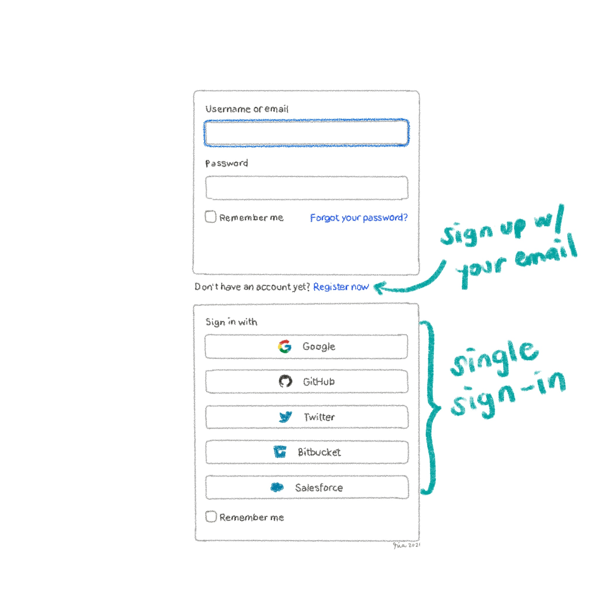

_We can't talk about GitHub without mentioning GitLab. Spoiler alert: it's equally awesome._

Have you tried your hand on [GitHub](https://www.rialitybytes.art/works/github-for-artists-using-github-repositories-for-online-storage) yet? If not, I really encourage that you give it a shot. Today, let's explore another popular application in the development world: [GitLab](https://about.gitlab.com/).

What is it? Here's the official description from their website:
> One application with endless possibilities. Organizations rely on GitLab’s source code management, CI/CD, security, and more to deliver software rapidly.

It might seem like a lot, but the bottomline is that it's an application that can help deverlopers do a lot of things—and if you're an artist, it can help you, too.

## Create a GitLab Account

1. Go to the GitLab [sign-in page](http://gitlab.com/users/sign_in).
2. Choose a sign-up method:
	a. Sign up using an email address - Click **Register now**.
	b. Sign in with another account - Click one of the available options.
4. Enter the required information and then click **Register** or **Sign in**.
Welcome to your brand new GitLab account.

## Create a GitLab Project

In GitLab speak, a repository or repo is called a project. This is where you can upload and store your files.

1. On your GitLab dashboard, click **New project**. GitLab displays the four options.
2. Click **Create a blank project**.
3. Type a project name.
4. Optional: Add a description to help you remember the repository contents.
5. Select the visibility level.
- Public - Anyone can view and access the files.
- Private - Only you and authorized users can view and access the files.
6. Enable **Initialize repository with a README**. A README file is a text file where you write a short description about the repository.  
**Important**: Unlike GitHub, you will need a README file in your project before you can start uploading files, so don't forget to check the box.
8. Click **Create project**.
That's it! Your project (repo) is now ready.

## Upload Files to GitLab

1. Click **++** and then click **Upload file**.
2. Drag and drop files from your local folder or click **click to upload**.
3. When you're done, click **Upload file**.
All done. You can stop there or keep uploading files.

## GitHub vs. GitLab

You might be wondering, why should you use one over the other? Good question. To be honest, I find the GitLab user interface a lot friendlier especially for folks like myself who don't use developer speak. I like how they use common terms like project instead of repository. While they still use common Git terms like commit and branch, the site just feels a lot friendlier, IMO. But that's just me. I encourage you to try both platforms and find out which will work best for you.
